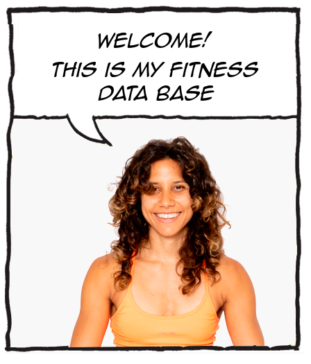

# YesFitness

## Structured Query Language SQL

### Portfolio

#### Fitness Company with the purpose of organize and perform better task

---

**Create de database**

Create tables, edited them and adding information in each table.
Updating info and deleting rows and data if neccesary.

Use different commands such as:
Data Definition Language (DDL) to define data tables.

Data Manipulation Language (DML) manipulation data in existing tables by adding, changing and removing data. 

Data Query Language select specific data from tables. Or used to group with DML commands.

Data Control Language grant permission to specific users.

Transaction Control Language used to change the state of some data.

_Roof draft_

```SQL
create table clients(
id_client INT NOT NULL auto_increment,
first_name VARCHAR (30) NOT NULL,
last_name VARCHAR (30) NOT NULL,
email varchar (50) NOT NULL,
birthday date,
weight float,
height INT,
currently_workout int NOT NULL,
times_per_week int NOT NULL,
primary key (id_client));

create table workouts(
id_workouts INT NOT NULL auto_increment,
name_of_workout varchar (30) not null,
workout_description varchar (200),
id_workout_level int not null,
primary key (id_workouts));

```


Tables:
1. _audits
2. best_voted
3. best_workouts
4. Clients
5. Exercises
6. best_workouts
7. order_details
8. payment
9. plan
10. week_days
11. workout_completed
12. workout_incompleted
13. workout_level
14. workouts

| Name   | Last Name    | Email              |
| ------ | ------------ | ------------------ |
| Yesika | Perez Ravelo | yesikapr@gmail.com |

[LinkedIn](https://www.linkedin.com/in/yesikaperezravelo/)

[FullPresentation](https://docs.google.com/presentation/d/1-dyvPrLhhd7odLnPzpWRcAHFByR9tqBg2ExS_S3EE30/edit?usp=sharing)


